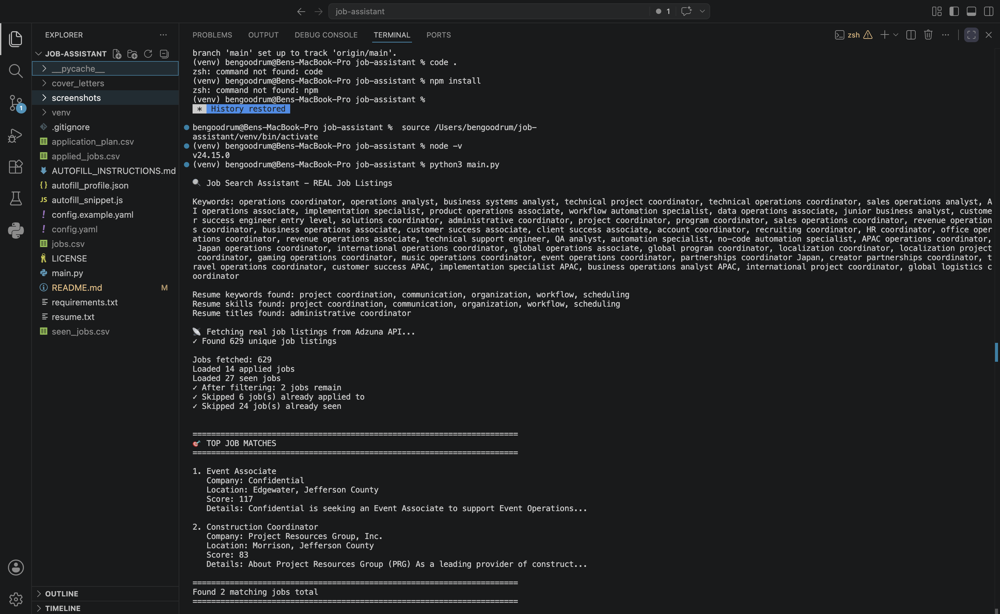

# AI-Assisted Job Automation System

A Python-based job automation workflow that searches, filters, ranks, and organizes job applications using APIs, configurable YAML logic, CSV pipelines, and automated PDF generation.

## Features

- Job aggregation using APIs
- Salary and experience filtering
- Duplicate prevention
- AI-assisted application messaging
- Automated PDF cover letter generation
- CSV tracking system
- YAML-based configuration
- Application ranking and scoring
- Role categorization
- International/APAC job targeting support

## Screenshots




## Technologies Used

- Python
- APIs
- CSV Processing
- YAML
- Github
- PDF Generation
- Workflow Automation

## Setup

```bash
pip install -r requirements.txt
python3 main.py
```

## Future Improvements

- Browser autofill integration
- SQL database support
- Web dashboard
- AI resume tailoring
- International job recommendation engine
- Improve automation workflows
